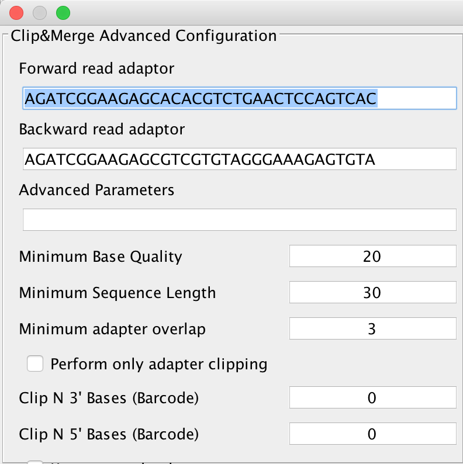
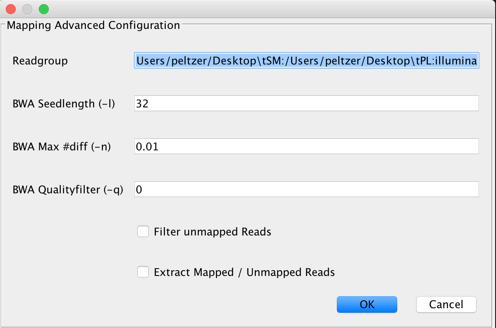
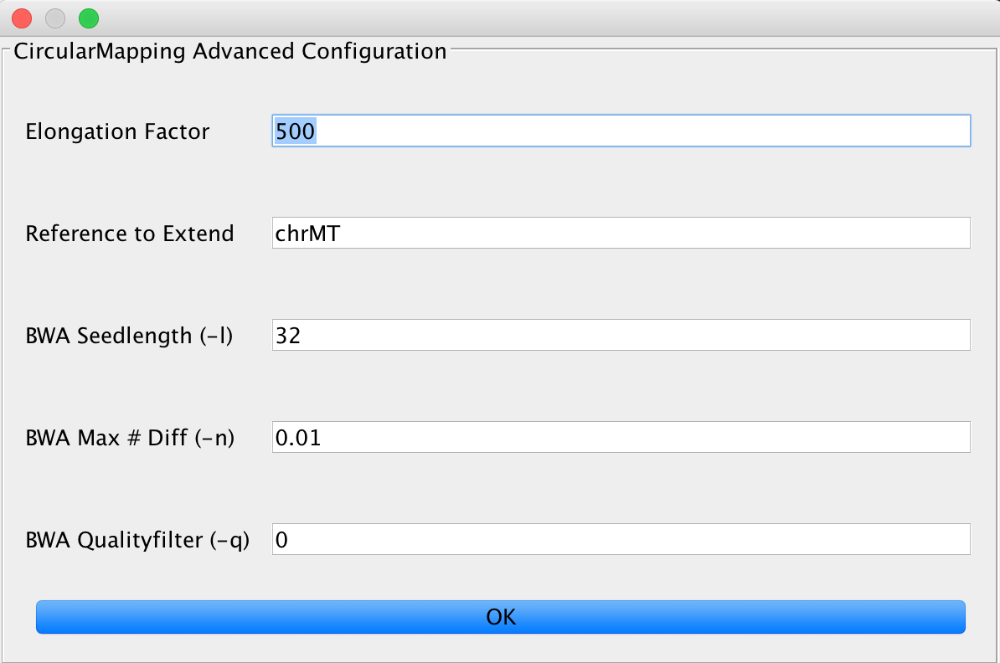
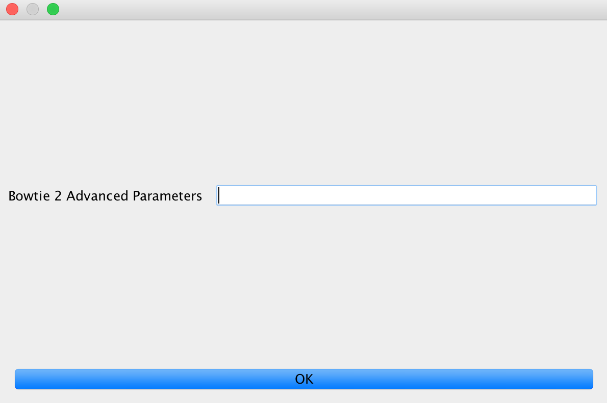
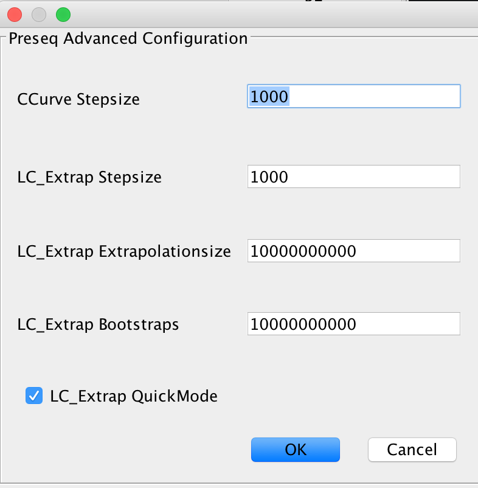
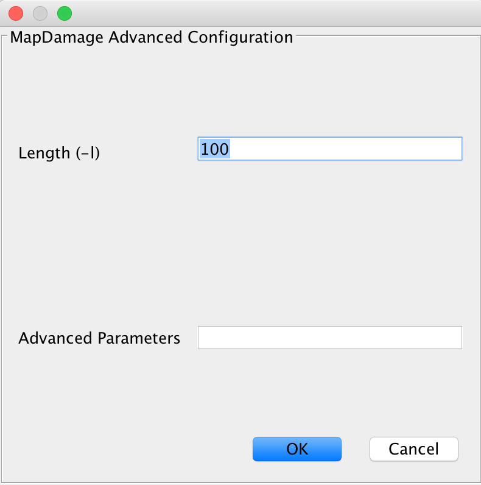
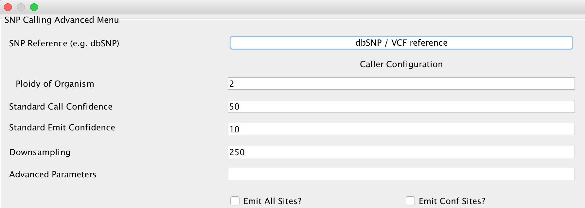
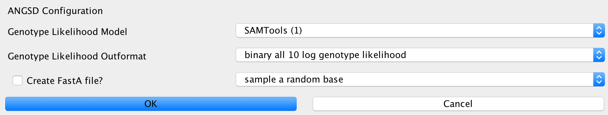
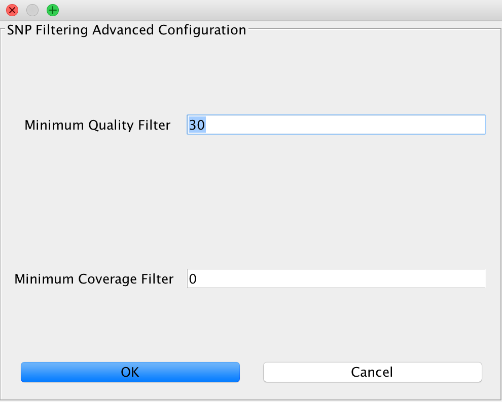
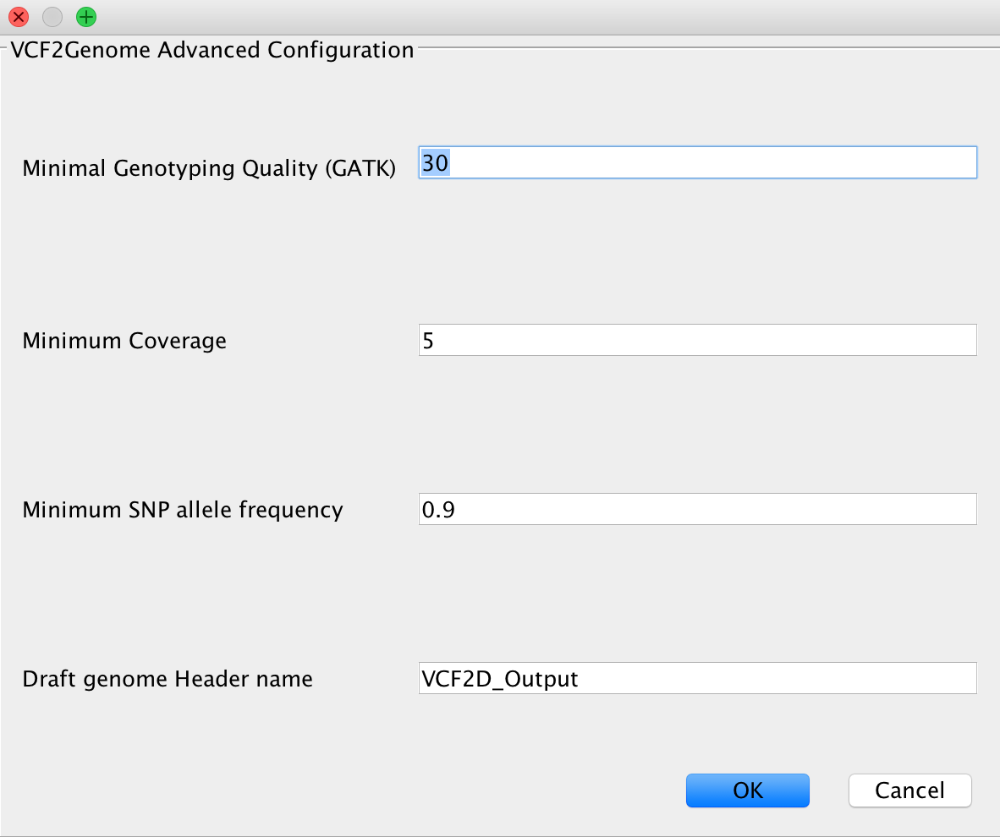

Module description
==================

EAGER comes with lots of different modules for different use cases, thus enabling the user to configure the pipeline in a fine granular way.
This section describes the different modules in more detail than e.g. the user tutorials that are offered here in the documentation too.

FastQC
------

This module can not be configured and is utilized to gain first insight into a raw sequencing dataset to determine important basic statistics, such as for example GC content and average read lengths prior to modifying the data. This should be used whenever you want to analyze data coming from sequencing without having an idea if even sequencing was successful as it creates basic plots showing whether the data is suitable for further downstream analysis.

Clip and Merge
--------------

This is our in-house application for adapter clipping and read merging. Clicking on the *Advanced* button next to this application, will

QualityFiltering
----------------

Mapping
-------

BWA
^^^

CircularMapper
^^^^^^^^^^^^^^

BWAMem
^^^^^^

Bowtie2
^^^^^^^

Stampy
^^^^^^

Complexity Estimation
---------------------

Remove Duplicates
-----------------

DeDup
^^^^^^

MarkDuplicates
^^^^^^^^^^^^^^

Contamination Estimation
------------------------

.. image:: images/modules/06_contaminationEstimation.png
    :width: 300px
    :height: 300px
    :align: center

Coverage/Statistics Calculation
-------------------------------

MapDamage Calculation
---------------------

SNP Calling
-----------

UnifiedGenotyper
^^^^^^^^^^^^^^^^

HaplotypeCaller
^^^^^^^^^^^^^^^^

ANGSD
^^^^^

SNP Filtering
-------------

VCF2Genome
----------

CleanUp
-------

Create Report
-------------
