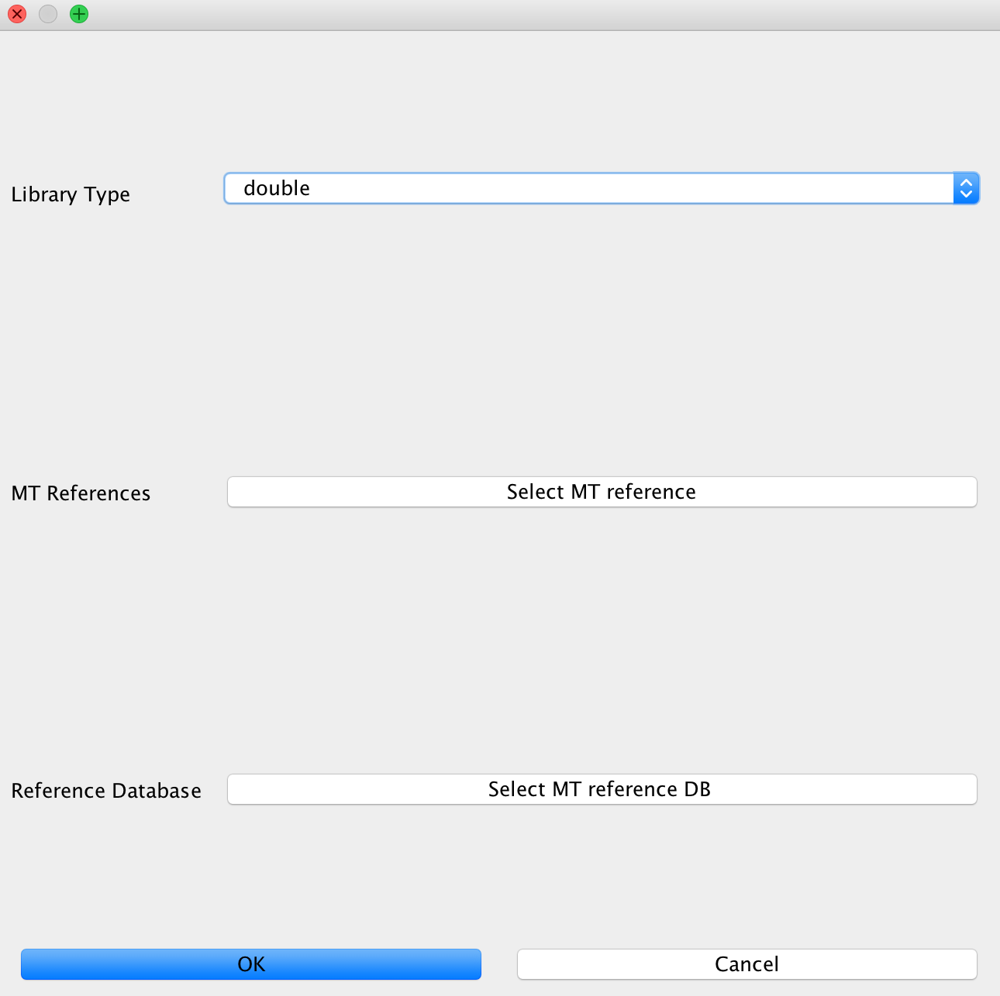
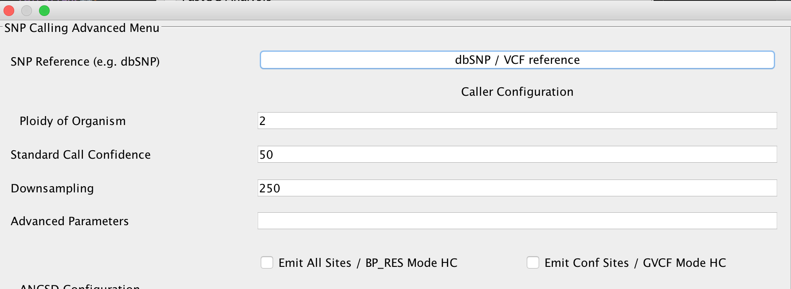

Module description
==================

EAGER comes with lots of different modules for different use cases, thus enabling the user to configure the pipeline in a fine granular way.
This section describes the different modules in more detail than e.g. the user tutorials that are offered here in the documentation too.

FastQC
------

This module can not be configured and is utilized to gain first insight into a raw sequencing dataset to determine important basic statistics, such as for example GC content and average read lengths prior to modifying the data. This should be used whenever you want to analyze data coming from sequencing without having an idea if even sequencing was successful as it creates basic plots showing whether the data is suitable for further downstream analysis.

Clip and Merge
--------------

This is our in-house application for adapter clipping and read merging. Clicking on the *Advanced* button next to this application, will open up a configuration window as depicted below.

You can select forward and reverse read adapters here that are then subsequently clipped off your sequencing reads during analysis. Furthermore, Clip&Merge performs a base quality trimming of unmerged reads, filters out sequences falling below a certain length. If you don't want to merge your reads, you can also specify to only clip adapters without merging reads afterwards. Barcodes are supported too, you can specify to trim bases from both 3' and 5' ends as well in the application.

.. warning::

  Specifying wrong adapters, trimming too many bases here will result in poor analysis performance, so make sure beforehand which adapters to use in your analysis.

QualityFiltering
----------------

For downward compatibility reasons, we have the possibility to filter sequences based on quality in the pipeline, too. This tool has been replaced by Clip and Merge and is therefore deactivated by default when Clip and Merge is selected.

Mapping
-------

These modules configure the read mapping process. EAGER currently features four mapping algorithms, which can be used. `BWA`, `CircularMapper` and `BWAMem` have been tested intensively, `Bowtie2` works well too, but can not be configured in detail as of now. `Stampy` is currently to be seen as experimental and may not work in all conditions.

BWA
^^^

This is the default mapping algorithm, largely used for mapping reads to ancient genomes and has been used in many ancient sequencing projects. If you're not sure what to use, use this algorithm.

.. image:: images/modules/02_mapping_BWA.png
    :width: 300px
    :height: 300px
    :align: center

.. note::

  If you're not sure which parameter you should be using for `-n`, use this web service to determine an optimal parameter for your data using an interactive choice `tool <https://apeltzer.shinyapps.io/BWAmismatches/>`_

CircularMapper
^^^^^^^^^^^^^^

BWAMem
^^^^^^
.. image:: images/modules/04_mapping_Bowtie2.png
    :width: 300px
    :height: 300px
    :align: center

Bowtie2
^^^^^^^

Stampy
^^^^^^

Complexity Estimation
---------------------

Remove Duplicates
-----------------

DeDup
^^^^^^

MarkDuplicates
^^^^^^^^^^^^^^

Contamination Estimation
------------------------

Coverage/Statistics Calculation
-------------------------------

MapDamage Calculation
---------------------

SNP Calling
-----------

UnifiedGenotyper
^^^^^^^^^^^^^^^^

HaplotypeCaller
^^^^^^^^^^^^^^^^

ANGSD
^^^^^

.. image:: images/modules/09_SNPcalling_ANGSD.png
    :width: 882px
    :height: 179px
    :align: center

SNP Filtering
-------------

VCF2Genome
----------

.. image:: images/modules/11_VCF2Genome.png
    :width: 300px
    :height: 300px
    :align: center

CleanUp
-------

Create Report
-------------
