.. _tutorials:

Tutorials
=========

This section describes several potential use cases for EAGER: A complete analysis of a couple of mitochondrial captures, a bacterial genome analysis and an analysis of human whole genome shotgun data.

Use case I: Mitochondrial analysis
----------------------------------

First, we will have to make sure that all data that we are using is there. This consists of three samples (Sample A-C) that have been created using a paired-end sequencing run on an Illumina sequencer. In order to run the analysis, we will utilize the EAGER pipeline and configure it step-by-step to run our analysis.

Step I: Data preparation
~~~~~~~~~~~~~~~~~~~~~~~~

You should have a couple of folders set up, mainly containing the data, making sure the data follows the guidelines for :ref:`naming_scheme` .
Ideally, your folder structure should look like:

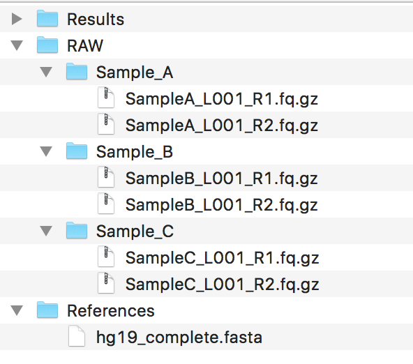

.. warning::
  If you need to perform genotyping, please ensure that your genome FastA file is ending with a `.fasta` file extension, or otherwise the GATK might complain about this.

Step II: Starting the GUI
~~~~~~~~~~~~~~~~~~~~~~~~~

Depending on your installation type, you should have ensured a working graphical user interface of EAGER and start it. Once you have started the GUI, you will be welcomed by the main user interface of EAGER.

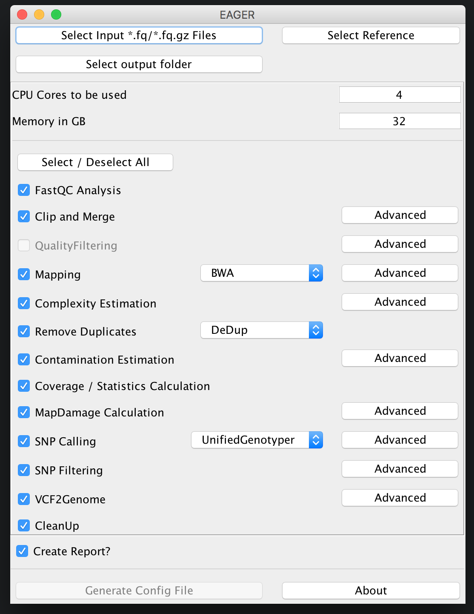

Step III: Selecting input
~~~~~~~~~~~~~~~~~~~~~~~~~

Selecting FastQ input
^^^^^^^^^^^^^^^^^^^^^

You can now click on *Select input \*fq/\*.fq.gz Files* and navigate to your folder where the RAW sequencing input is stored on your network share or local hard drive.

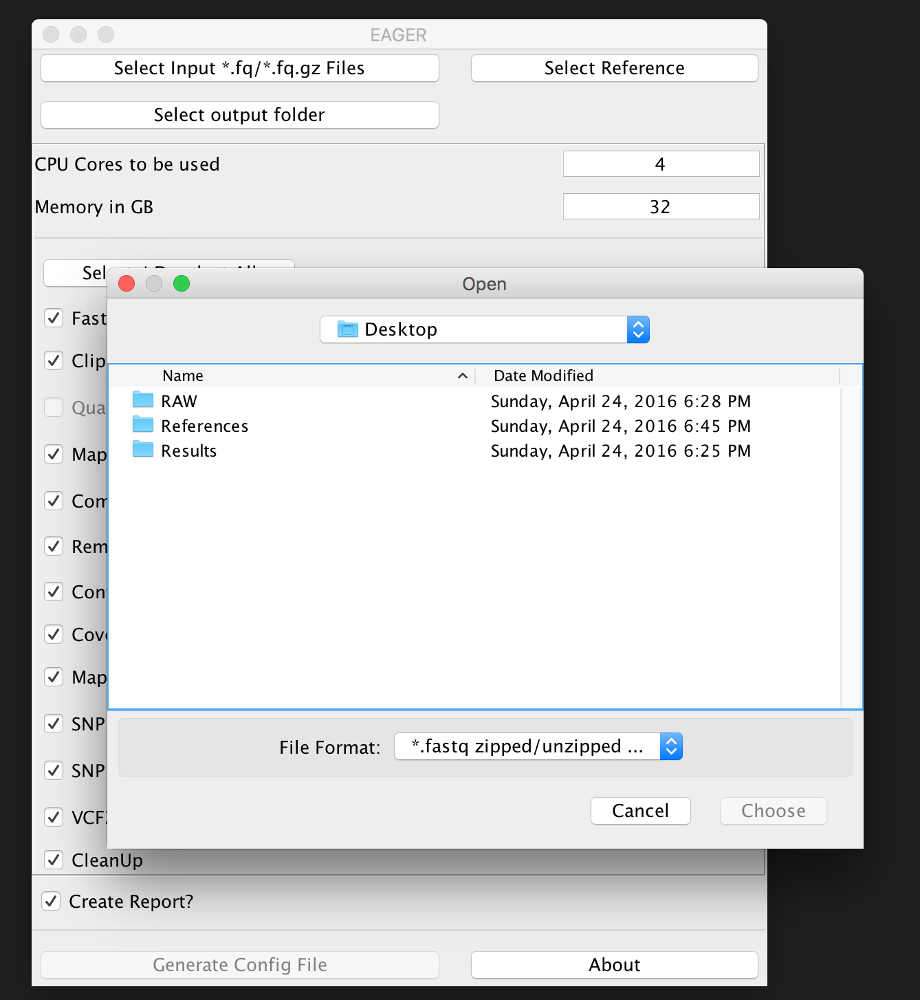

.. note::

  You may select **either** single/multiple FastQ files, **or** a folder containing subfolders with FastQ files. EAGER will pick up every FastQ file in all subfolders automatically.

In our case here, we simply select the folder `RAW` and click on *Choose*. A new window is opening up, asking you several questions to determine which kind of analysis should be performed on the selected data.

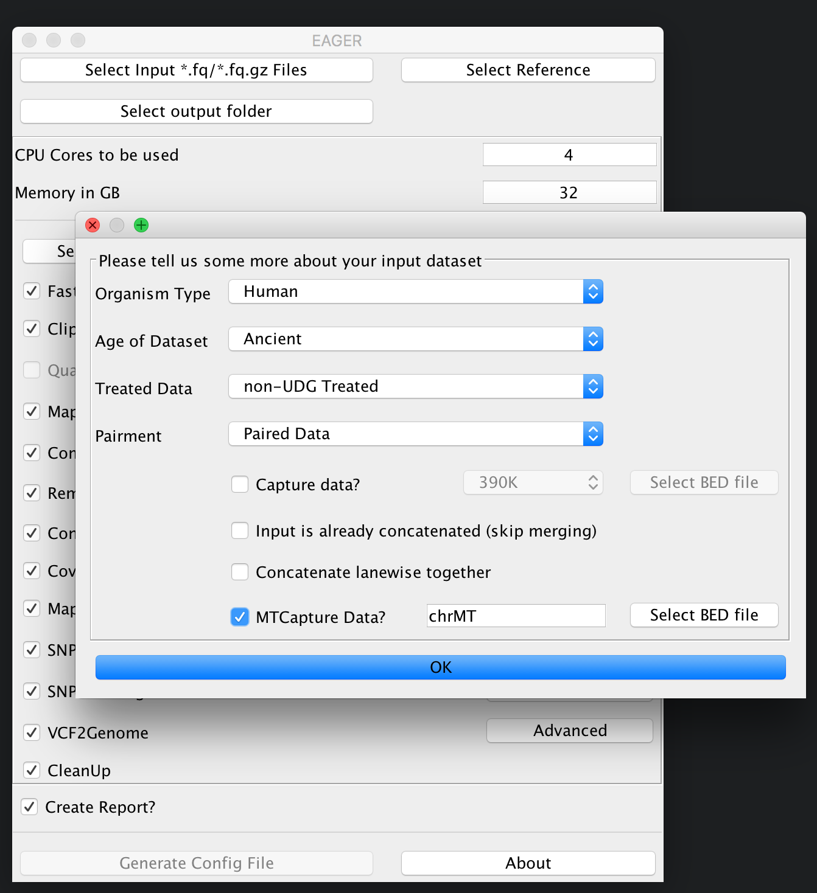

In our case here, we choose that our data has not been treated with UDG, we have paired-end sequencing data and want to analyse a mitochondrial capture dataset.

.. note::

  You have to specify a **BED** file for your reference genome if you want to analyse capture data in general. A typical BED file that could be used e.g. for HG19 mitochondrial analysis could look like this.

  .. code-block:: bash

    chrMT 1 16770 MT 1 +

Once you are done with selecting the appropriate BED file, you can click *ok* and the *Select input \*fq/\*.fq.gz Files* button on top of the GUI should be green to display, that you have successfully selected your input dataset.

Selecting your reference genome
^^^^^^^^^^^^^^^^^^^^^^^^^^^^^^^

Continue now by clicking on *Select Reference* and select your reference genome in FastA format.

.. note::

  You don't need to index any reference genomes manually. EAGER will take care of generating required indices on-the-fly when running the pipeline. If an index has been created, the pipeline will figure this out and no new one will be generated to save disk space and time.

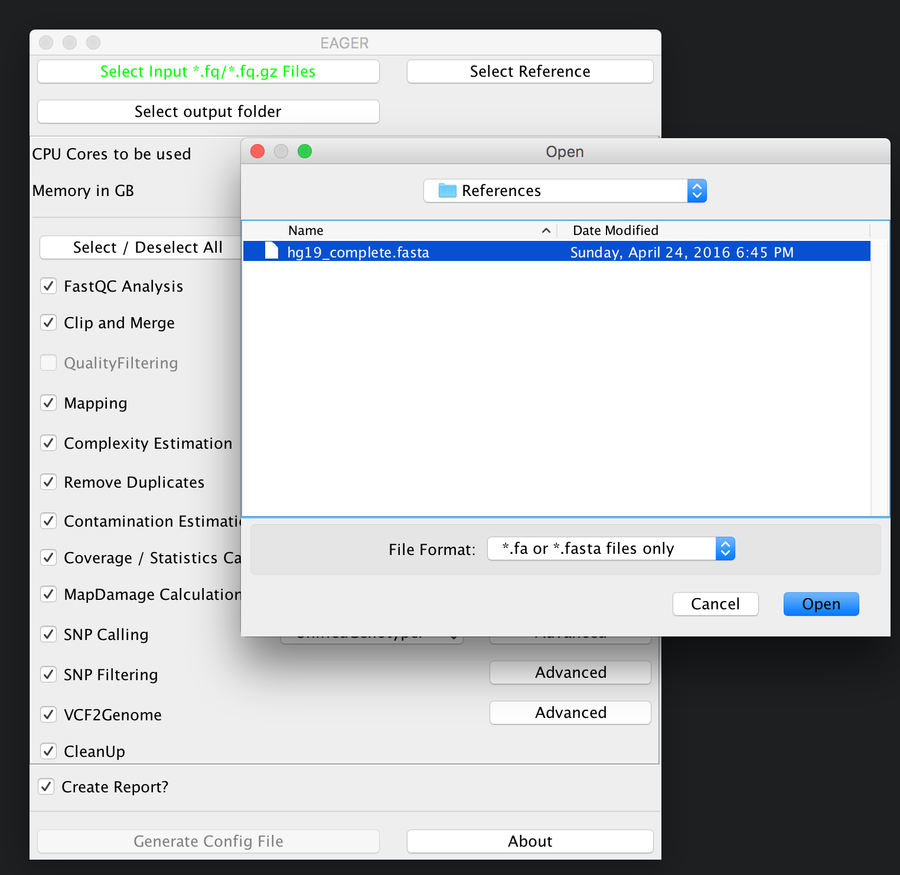

Selecting your results folder
^^^^^^^^^^^^^^^^^^^^^^^^^^^^^

.. note::

  EAGER uses a typical folder structure to store any produced output. This is called the results folder, in which EAGER creates subfolders on a per-sample basis, then populating these with the typical EAGER folder structure.

Simply click on the *Select output folder* button, then select a folder of your choice to store the analysis results in the end.

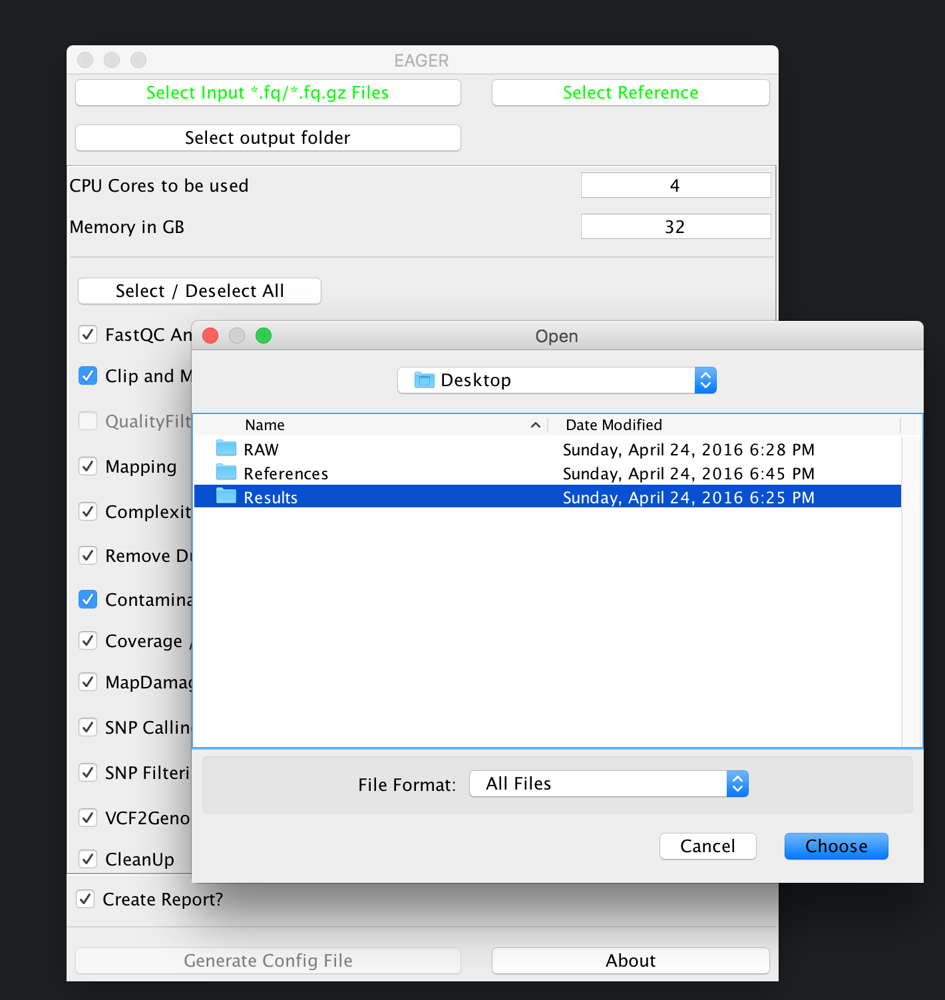

.. warning::

  You have to ensure that you have proper access rights to the results folder and the reference genome FastA file or otherwise the analysis will fail.

Step IV: Configure your Analysis
~~~~~~~~~~~~~~~~~~~~~~~~~~~~~~~~

Now that you have selected your input data, your reference genome and the corresponding output folder, you can configure the pipeline more in detail. Start by configuring how many CPU cores and how much random access memory (RAM) can be used by the pipeline for your analysis.

.. warning::

  If you're unsure what to select for CPU cores and/or RAM consumption, you may want to look up your system configuration prior to starting an analysis here. Some processes can fail and make your system unstable when failing if you select too many CPU cores / use too much memory.

For a mitochondrial analysis, EAGER offers special features, e.g. a special mapping application called `CircularMapper` that produces improved mappings at both ends of your reference genome. In this case we basically keep most of the configuration at default settings, keeping initial FastQC analysis, Clip&Merge, Mapping with CircularMapper, Duplicate Removal, Contamination Estimation with Schmutzi, Coverage Calculation and MapDamage Calculation turned on but disabling the genotyping part of the pipeline. A final report in CSV format is also desirable in many applications, so we keep this turned on as well.

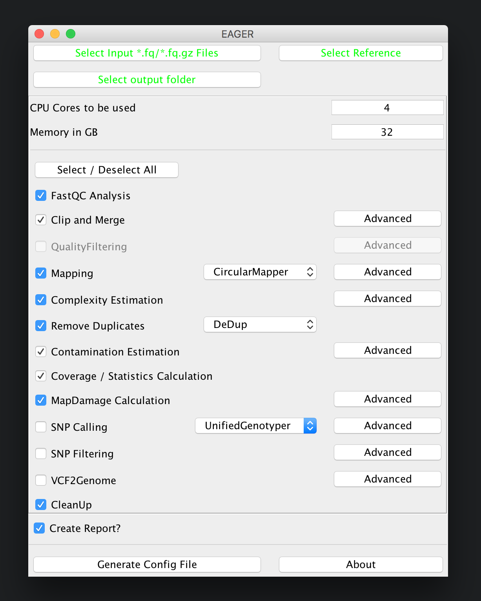

.. note::

  The CleanUp module is removing *redundant* data, e.g. intermediate processing results, that are stored in different file formats to save disk space. In almost all cases you can safely keep this module turned on without compromising your analysis results.

After you are done with the configuration of the selected modules, e.g. by clicking on the *Advanced* buttons of the respective tools, you may click on *Generate Config File* on the bottom of the GUI to generate the required pipeline configuration files. A window should open up, telling you that your analysis run has been configured successfully.

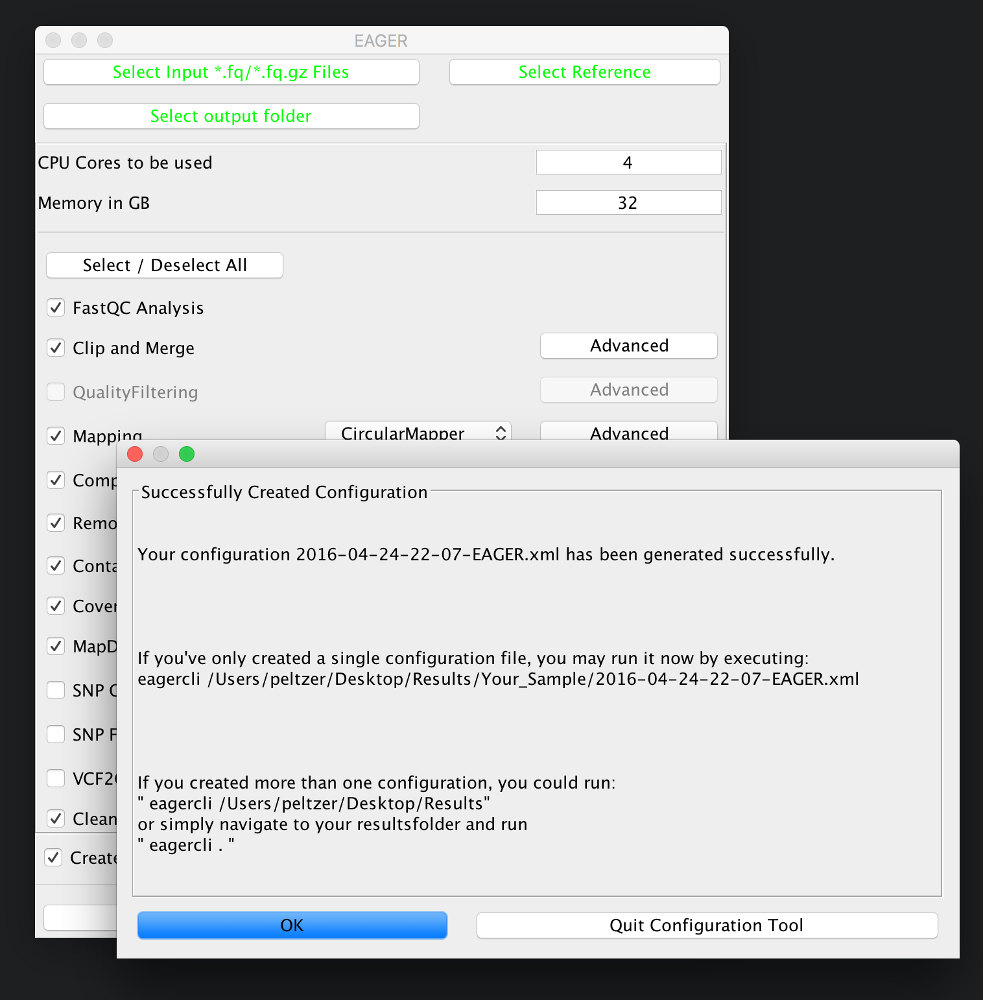

Step V: Run the Analysis Pipeline
~~~~~~~~~~~~~~~~~~~~~~~~~~~~~~~~~

In order to execute the generated configuration files, the GUI is already giving you a little hint on how to run the execution part of the pipeline. Open up a Terminal application of your choice and then navigate to your folder(s) containing the configuration files (your *result* folder) and run the `eagercli` command to execute the configuration file(s):

.. code-block: bash

  cd /Users/peltzer/Desktop/Results
  eagercli .

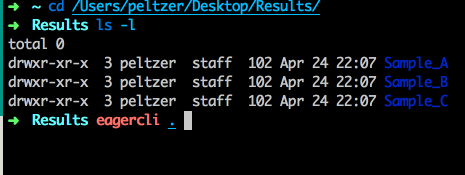

.. note::

  You don't need to specify the full path to the generated configuration files, e.g. if you specify the *results* folder, EAGER will detect all configuration files automatically and run these sequentially after each other. For some purposes (e.g. a cluster system) you might want to schedule single jobs for each configuration file however, which can be done by specifying the path to the respective configuration files directly.

Step VI: Pick up results!
~~~~~~~~~~~~~~~~~~~~~~~~~

EAGER creates a CSV based report file in the results folder, which contains statistics for the analysis run. A typical results report looks like this:

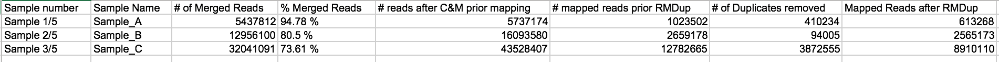

All the output BAM files, VCF files and other important analysis results can be found in the sample specific folders in the results folder.

.. note:: You can import the results table in CSV format in any compatible sheet calculation software, LibreOffice for example works very well.

Use case II: Bacterial analysis
-------------------------------

EAGER can be used to reconstruct ancient bacterial genomes in an efficient way, too. In order to perform such a bacterial genome reconstruction, we will be reconstructing three sample entries from ancient bacterial data in this tutorial using a *S. aureus* reference genome in FastA format.

Step I: Data preparation
~~~~~~~~~~~~~~~~~~~~~~~~

You should have a couple of folders set up, mainly containing the data, making sure the data follows the guidelines for :ref:`naming_scheme` .
Ideally, your folder structure should look like:

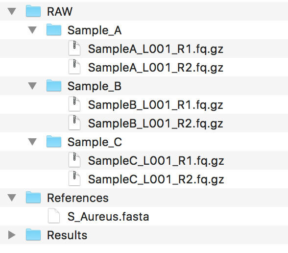

.. warning::
  As we do perform genotyping using the GATK, please ensure that your genome FastA file is ending with a `.fasta` file extension. If you don't do this, the pipeline can fail.

Step II: Starting the GUI
~~~~~~~~~~~~~~~~~~~~~~~~~

Depending on your installation type, you should have ensured a working graphical user interface of EAGER and start it. Once you have started the GUI, you will be welcomed by the main user interface of EAGER.

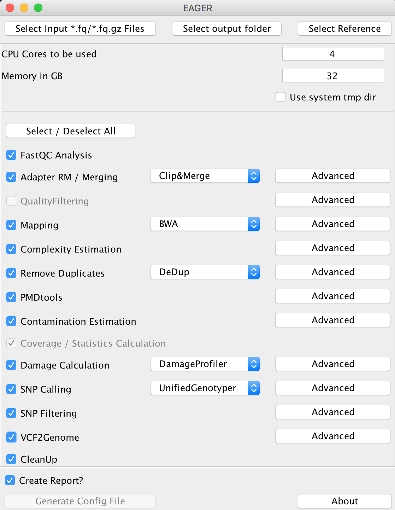

Step III: Selecting input
~~~~~~~~~~~~~~~~~~~~~~~~~

Selecting FastQ input
^^^^^^^^^^^^^^^^^^^^^
You can now click on *Select input \*fq/\*.fq.gz Files* and navigate to your folder where the RAW sequencing input is stored on your network share or local hard drive.

.. image:: images/tutorials/bacteria/03_select_input.png
   :width: 300px
   :height: 300px
   :align: center

.. note::

  You may select **either** single/multiple FastQ files, **or** a folder containing subfolders with FastQ files. EAGER will pick up every FastQ file in all subfolders automatically.

In our case here, we simply select the folder `RAW` and click on *Choose*. A new window is opening up, asking you several questions to determine which kind of analysis should be performed on the selected data.

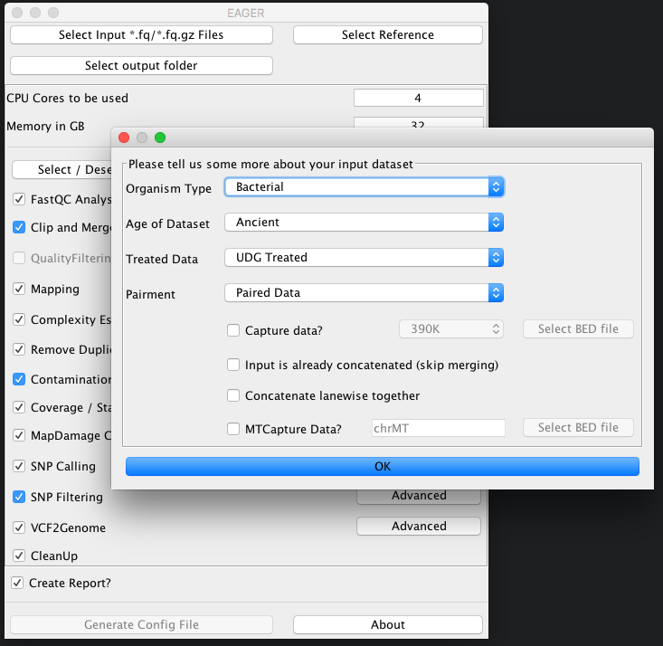

As we have UDG treated ancient bacterial data here, which has been sequenced in paired-end sequencing mode, we simply select the appropriate types and click on *OK*.
The *Select input \*fq/\*.fq.gz Files* button on top of the GUI should be green to display, that you have successfully selected your input dataset.

Selecting your reference genome
^^^^^^^^^^^^^^^^^^^^^^^^^^^^^^^

Continue now by clicking on *Select Reference* and select your reference genome in FastA format.

.. note::

  You don't need to index any reference genomes manually. EAGER will take care of generating required indices on-the-fly when running the pipeline. If an index has been created, the pipeline will figure this out and no new one will be generated to save disk space and time.

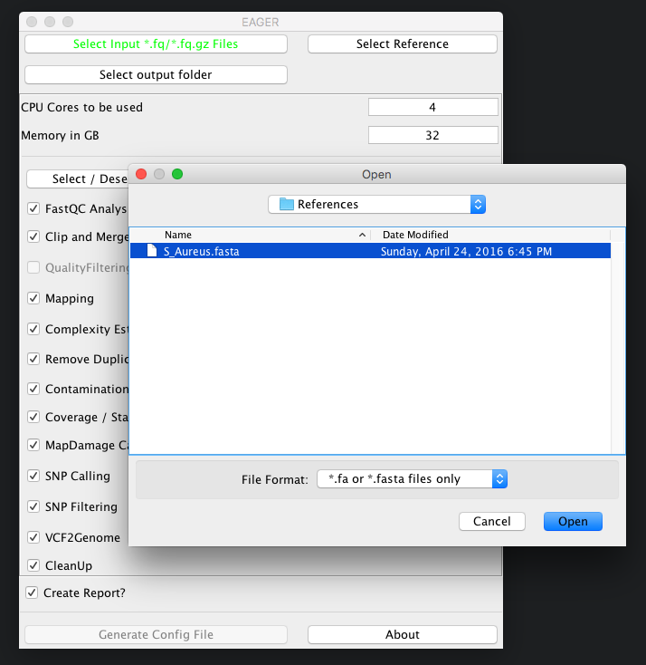

Selecting your results folder
^^^^^^^^^^^^^^^^^^^^^^^^^^^^^

.. note::

  EAGER uses a typical folder structure to store any produced output. This is called the results folder, in which EAGER creates subfolders on a per-sample basis, then populating these with the typical EAGER folder structure.

Simply click on the *Select output folder* button, then select a folder of your choice to store the analysis results in the end.

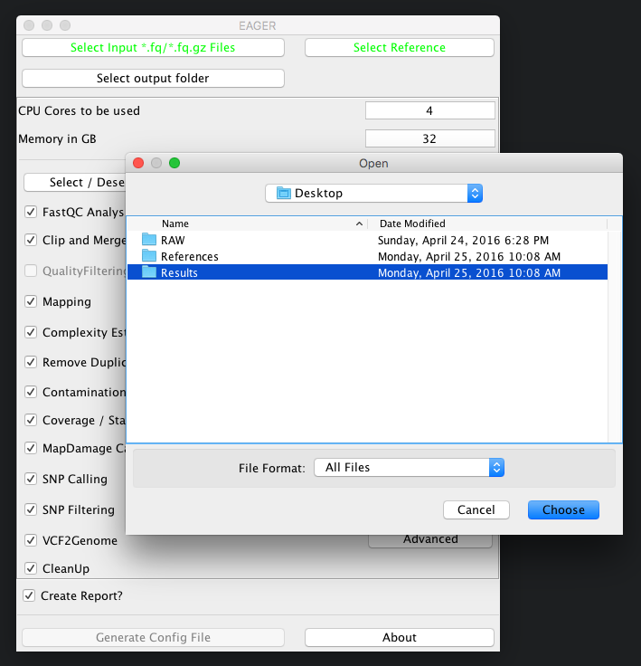

.. warning::

  You have to ensure that you have proper access rights to the results folder and the reference genome FastA file or otherwise the analysis will fail.

Step IV: Configure your Analysis
~~~~~~~~~~~~~~~~~~~~~~~~~~~~~~~~

Now that you have selected your input data, your reference genome and the corresponding output folder, you can configure the pipeline more in detail. Start by configuring how many CPU cores and how much random access memory (RAM) can be used by the pipeline for your analysis.

.. warning::

  If you're unsure what to select for CPU cores and/or RAM consumption, you may want to look up your system configuration prior to starting an analysis here. Some processes can fail and make your system unstable when failing if you select too many CPU cores / use too much memory.

For bacterial data analysis, you may want to deselect the Contamination Estimation module, as it is tailored to mitochondrial contamination estimation and less suited for bacterial data. We would like to get a final FastA file with our called variants incorporated, so we keep the SNP calling, filtering and the VCF2Genome modules turned on in the pipeline.

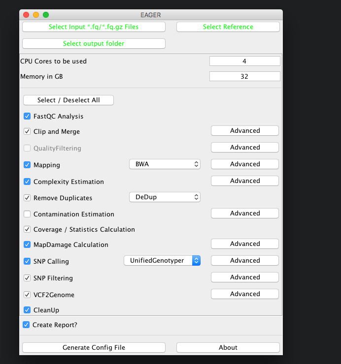

.. note::

  The CleanUp module is removing *redundant* data, e.g. intermediate processing results, that are stored in different file formats to save disk space. In almost all cases you can safely keep this module turned on without compromising your analysis results.

After you are done with the configuration of the selected modules, e.g. by clicking on the *Advanced* buttons of the respective tools, you may click on *Generate Config File* on the bottom of the GUI to generate the required pipeline configuration files. A window should open up, telling you that your analysis run has been configured successfully.

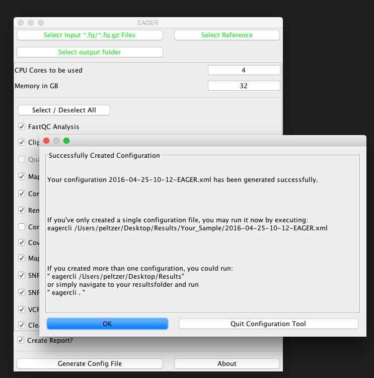

Step V: Run the Analysis Pipeline
~~~~~~~~~~~~~~~~~~~~~~~~~~~~~~~~~

In order to execute the generated configuration files, the GUI is already giving you a little hint on how to run the execution part of the pipeline. Open up a Terminal application of your choice and then navigate to your folder(s) containing the configuration files (your *result* folder) and run the `eagercli` command to execute the configuration file(s):

.. code-block: bash

  cd /Users/peltzer/Desktop/Results
  eagercli .

.. note::

  You don't need to specify the full path to the generated configuration files, e.g. if you specify the *results* folder, EAGER will detect all configuration files automatically and run these sequentially after each other. For some purposes (e.g. a cluster system) you might want to schedule single jobs for each configuration file however, which can be done by specifying the path to the respective configuration files directly.

Step VI: Pick up results!
~~~~~~~~~~~~~~~~~~~~~~~~~

EAGER creates a CSV based report file in the results folder, which contains statistics for the analysis run. A typical results report looks like this:

All the output BAM files, VCF files and other important analysis results can be found in the sample specific folders in the results folder.

.. note:: You can import the results table in CSV format in any compatible sheet calculation software, LibreOffice for example works very well.

Use Case III: Human (WGS) analysis
----------------------------------
